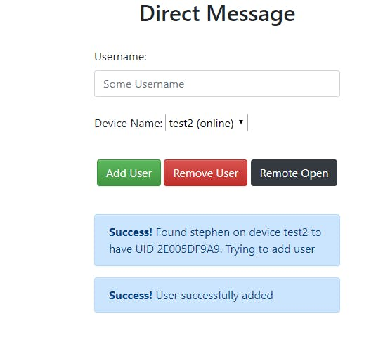
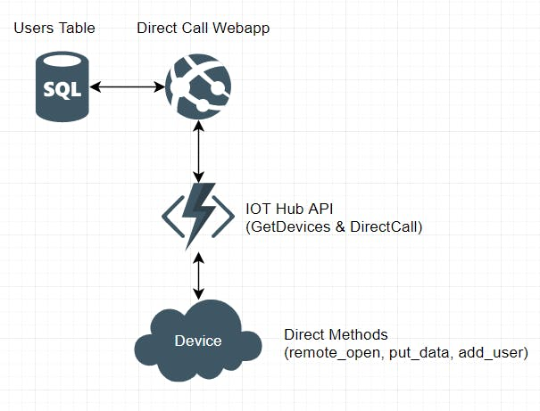

# Azure Sphere Direct Web Call App



Flask application built as part of the Azure Sphere ["Secure Everything"](https://www.hackster.io/lock-and-load/azure-sphere-iot-enabled-rfid-lock-e73f70) contest run by Hackster.io. A full tutorial is available there.

This flask app connects to a Microsoft SQl database and a C# API found [here](https://github.com/SrzStephen/Azure-IOT-Hub-API) to act as a management UI for the Azure Sphere lock project. This UI allows users to remotely add/remove users from the door, and allows the door to be remotely opened.




# Running
This application is designed to be run in [Azure App Service](https://azure.microsoft.com/en-au/services/app-service/). Generally if you upload it to the app service and set the following environment variables, you should be fine

```azure
az webapp config appsettings set
 --name {webapp name} \
 --resource-group {group name} \
 --settings-names "AZURE_API_ENDPOINT={azure endpoint url} AZURE_API_HOST_KEY={host key} DATABASE_USER={database username} DATABASE_PASSWORD={database password} DATABASE_SERVER={database server} DATABASE_DATABASE={database}"
```
If you're running this locally you'll want to set these environment variables in your environment.
```zsh
AZURE_API_ENDPOINT
AZURE_API_HOST_KEY
DATABASE_USER
DATABASE_PASSWORD
DATABASE_SERVER
DATABASE_DATABASE
DATABASE_TABLE
```
Database schema can be generated with 
```sql
CREATE TABLE {YOUR DATABASE NAME HERE}.dbo.Users (
card_UID varchar(20) COLLATE SQL_Latin1_General_CP1_CI_AS NOT NULL,
username varchar(100) COLLATE SQL_Latin1_General_CP1_CI_AS NOT NULL,
door_device varchar(100) COLLATE SQL_Latin1_General_CP1_CI_AS NOT NULL
) GO
```
If you get an error refering to sql.h, similar to this.
```zsh
src/pyodbc.h:56:10: fatal error: sql.h: No such file or directory
#include <sql.h>
```
you will need to install [Microsoft ODBC Driver for SQL Server](https://docs.microsoft.com/en-us/sql/connect/odbc/microsoft-odbc-driver-for-sql-server?view=sql-server-ver15)